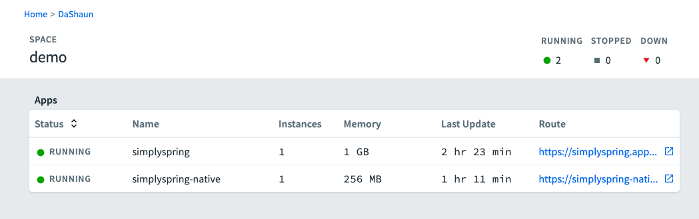

## Cloud Foundry increases its value with Spring Boot 3


> 75% smaller container

Some of your Spring Boot 3 application might be more cost-effective as `native` images.

Spring Boot 3 with AOT processing can significantly reduce the memory-footprint of the container needed to run your application.

There are a lot of things to consider before moving forward:
- There is no JVM to connect agents to
- Some workloads will be more performant, some workloads will be less performant, "it depends"
- The cost:value metric needs to be considered
  - The application performance changes by +/- X percent
  - The application cost is reduced by 25 to 75 percent

There are thousands of workloads, running on TAS today, that could get a huge refund, with minimal effort.

## Clone this repository

I created the application with this command:

```bash
curl https://start.spring.io/starter.tgz -d dependencies=web,actuator,native -d javaVersion=17 -d bootVersion=3.0.2 -d type=maven-project | tar -xzf -
```

## Login to your Cloud Foundry instance

```bash
cf login
# Push the app using java buildpack
cf push -f manifest-java.yaml
# Push a native-image version of the app created via `./mvnw -Pnative native:compile`
cf push simplyspring-native -c './demo' -b binary_buildpack -m 256M
```

Side-by-side deployments.

## Buildpacks

Here is a look at the buildpacks available on my foundation.

```bash
cf buildpacks
```
```text
Getting buildpacks as dashaun...

position   name                     stack        enabled   locked   filename
1          staticfile_buildpack     cflinuxfs3   true      false    staticfile_buildpack-cached-cflinuxfs3-v1.5.35.zip
2          dotnet_core_buildpack    cflinuxfs4   true      false    dotnet-core_buildpack-cached-cflinuxfs4-v2.4.2.zip
3          dotnet_core_buildpack    cflinuxfs3   true      false    dotnet-core_buildpack-cached-cflinuxfs3-v2.4.2.zip
4          php_buildpack            cflinuxfs3   true      false    php_buildpack-cached-cflinuxfs3-v4.4.67.zip
5          java_buildpack_offline   cflinuxfs3   true      false    java-buildpack-offline-cflinuxfs3-v4.53.zip
6          java_buildpack_offline   cflinuxfs4   true      false    java-buildpack-offline-cflinuxfs4-v4.53.zip
7          ruby_buildpack           cflinuxfs3   true      false    ruby_buildpack-cached-cflinuxfs3-v1.8.59.zip
8          nginx_buildpack          cflinuxfs3   true      false    nginx_buildpack-cached-cflinuxfs3-v1.1.45.zip
9          nodejs_buildpack         cflinuxfs3   true      false    nodejs_buildpack-cached-cflinuxfs3-v1.8.3.zip
10         nodejs_buildpack         cflinuxfs4   true      false    nodejs_buildpack-cached-cflinuxfs4-v1.8.3.zip
11         go_buildpack             cflinuxfs3   true      false    go_buildpack-cached-cflinuxfs3-v1.10.0.zip
12         r_buildpack              cflinuxfs3   true      false    r_buildpack-cached-cflinuxfs3-v1.1.34.zip
13         python_buildpack         cflinuxfs3   true      false    python_buildpack-cached-cflinuxfs3-v1.8.0.zip
14         binary_buildpack         cflinuxfs3   true      false    binary_buildpack-cached-cflinuxfs3-v1.0.47.zip
15         binary_buildpack         windows      true      false    binary_buildpack-cached-windows-v1.0.47.zip
```

## What would it take to see these benefits?

1.  Upgrade to Java 17, to see the performance benefits first
2.  Upgrade to Spring Boot 3, to get the AOT native-image processing capabilities
3.  Change your pipeline to deploy the binary native-image instead of with Java buildpack

For most workloads, there will be zero code changes required.
Some workloads that are referencing the javax.* packages, will need some attention.
However, most IDEs make the javax to jakarta changes automatic.
There is also the Spring Boot Migrator that can handle those migrations at scale.

## Would you like help?

- Please, reach out to me directly.
- Open an 'issue' in this repository, and provide as much detail as possible.

## Want to share your story?

- Let me know if it worked OR if it didn't work
- Maybe join me on a blog/podcast/stream/webinar together we can help the larger community, even more!